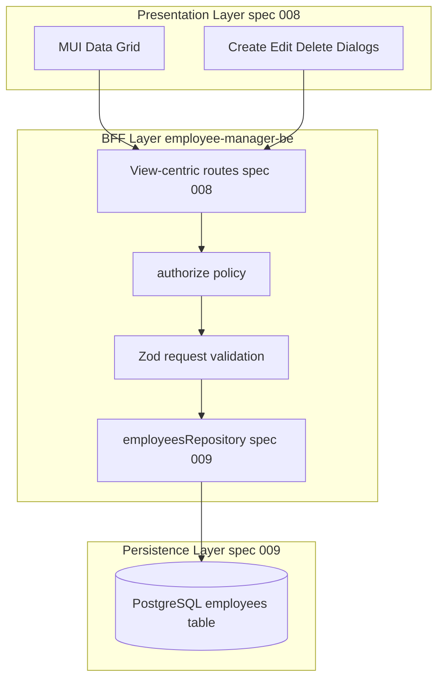

# Data Architecture: Employee Persistence

Defines how employee data flows across layers, naming conventions, and persistence boundaries for spec 009.

## Principles

1. **PostgreSQL is the system of record** for employee entities.
2. **OpenAPI is the external contract** (spec 008); API field names use camelCase.
3. **Database columns use snake_case**; mapping happens only in the repository layer.
4. **BFF owns validation and authorization** before any repository call.
5. **No direct SQL in route handlers** — routes call repository functions only.
6. **Deny-by-default** applies to data access: unauthorized requests never reach repository mutations.

## Layered architecture

## Repository boundary

The repository module is the only layer that:

- Opens SQL connections (via shared pool helper)
- Executes queries against `employees`
- Maps DB rows to domain/API shapes

Route handlers MUST NOT embed SQL strings.

### Repository responsibilities

| Function | Purpose |
|----------|---------|
| `listEmployees(filters)` | Read with optional name/department filters |
| `getEmployeeById(id)` | Single row fetch |
| `createEmployee(input)` | Insert with unique email enforcement |
| `updateEmployee(id, input)` | Full replace update |
| `deleteEmployee(id)` | Hard delete (v1) |

## Domain vs API vs database mapping

| API (OpenAPI spec 008) | Domain/TS | DB column |
|---------------|-----------|-----------|
| `id` | `id` | `id` |
| `fullName` | `fullName` | `full_name` |
| `email` | `email` | `email` |
| `department` | `department` | `department` |
| `jobTitle` | `jobTitle` | `job_title` |
| `employmentStatus` | `employmentStatus` | `employment_status` |
| `managerName` | `managerName` | `manager_name` |
| `startDate` | `startDate` | `start_date` |
| `phone` | `phone` | `phone` |
| `location` | `location` | `location` |
| `createdAt` | `createdAt` | `created_at` |
| `updatedAt` | `updatedAt` | `updated_at` |

Entity field definitions and validation rules: see [`data-model.md`](data-model.md).

## Connection management

- Reuse existing Postgres env config from `employee-manager-be` (`POSTGRES_*` in `.env`).
- Introduce a **shared connection pool** for application queries (distinct from the short-lived probe in spec 002).
- Probe (`SELECT 1`) remains for startup/health; repository uses pooled connections for CRUD.

Recommended pool defaults (v1):

- `max`: 10
- `idle_timeout`: 20s
- `connect_timeout`: 5s

## Transaction strategy (v1)

- **Single-row CRUD**: one statement per operation, no explicit transaction wrapper required.
- **Future multi-table writes**: use explicit transactions at repository level (not in routes).
- Duplicate email conflicts rely on DB unique constraint + mapped `409 DUPLICATE_EMAIL`.

## Query strategy

### List + search + filter

Single query with parameterized WHERE clauses:

- `name` filter: `LOWER(full_name) LIKE LOWER($pattern)` with `%` wrapping
- `department` filter: `department = $department`
- Combined filters use AND

Default sort for grid v1: `full_name ASC`.

### Index usage

See migration in [`data-model.md`](data-model.md):

- `LOWER(full_name)` index supports name search
- `department` index supports department filter

## Data lifecycle

| Event | Behavior |
|-------|----------|
| Create | Set `created_at`, `updated_at` via DB default/trigger |
| Update | Refresh `updated_at` on every successful update |
| Delete | Hard delete in v1 (no soft-delete column yet) |

Soft-delete and audit history are deferred to a future spec if required.

## Error mapping at data boundary

| DB / driver condition | HTTP | ApiError code |
|----------------------|------|---------------|
| Unique violation on `email` | 409 | `DUPLICATE_EMAIL` |
| Row not found on update/delete | 404 | `NOT_FOUND` |
| Connection/query failure | 500 | generic error (logged server-side) |

## Testing strategy for data layer

1. **Repository unit/integration tests** against real Postgres in local/dev (or test DB).
2. **Route tests** may mock repository for auth-focused cases; at least one integration path MUST hit real SQL.
3. **CI (current)**: repository tests may remain local-only until service-container Postgres is adopted (see roadmap spec 007); mock repository used in CI route tests until then.

## Related documents

- [`spec.md`](spec.md) — feature requirements
- [`data-model.md`](data-model.md) — entity fields and table DDL
- [`database-management.md`](database-management.md) — migrations, seeds, env, operational practices
- [`../008-employee-crud-mui/contracts/openapi.yaml`](../008-employee-crud-mui/contracts/openapi.yaml) — API contract (spec 008)
