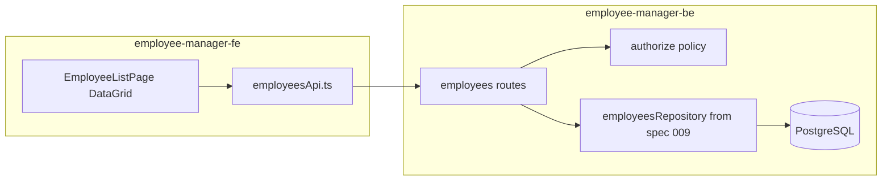

# Implementation Plan: Employee CRUD with Material UI Data Grid

**Branch**: `008-employee-crud-mui` | **Date**: 2026-05-28 | **Spec**: [`spec.md`](spec.md)  
**Input**: Feature specification from `/specs/features/008-employee-crud-mui/spec.md`

## Summary

Deliver employee CRUD as the new root-page experience in `employee-manager-fe`, using Material UI (including Data Grid) for list/search/filter/create/edit/delete flows. Extend auth phase-1 policy for employee actions and document canonical OpenAPI contracts under this feature folder for FE codegen. Employee persistence is defined separately in spec 009.

## Technical Context

**Language/Version**: TypeScript (FE ~6.x, BE ~5.9), Bun runtime, React 19.x  
**Primary Dependencies**: Material UI, MUI X Data Grid, Hono (BE), Zod validation  
**Storage**: PostgreSQL via spec 009 employee data architecture (dependency)  
**Testing**: Bun test; BE route tests with mocked repository/auth; FE service tests with MSW  
**Target Platform**: Local developer browsers and CI  
**Project Type**: Multi-repo (`employee-manager-fe`, `employee-manager-be`, `system-specs`)  
**Performance Goals**: Grid refresh within 2 seconds after successful mutations (per spec SC-004)  
**Constraints**: Reuse auth phase-1 mock principal headers until real auth; deny-by-default authorization; OpenAPI as contract source of truth  
**Scale/Scope**: Single root-page grid + modal/dialog forms; desktop-first admin UX

## Constitution Check

- **Gate 1 (Test-first)**: Add failing BE route and FE service/UI tests before implementation.
- **Gate 2 (Simplicity)**: One FE API service module, one grid page, one BE routes module — repository from spec 009.
- **Gate 3 (TypeScript safety)**: Zod schemas at BE boundary; OpenAPI-generated types on FE where practical.
- **Gate 4 (Documentation)**: Feature `quickstart.md`, contract README, and repo README updates for new endpoints.
- **Architecture**: Material UI on FE; view-centric BFF paths for grid and form widgets (see contracts).

No constitution violations anticipated.

## Project Structure

### Documentation (this feature)

```text
specs/features/008-employee-crud-mui/
├── spec.md
├── plan.md
├── research.md
├── data-model.md
├── quickstart.md
├── contracts/
│   ├── openapi.yaml
│   └── README.md
└── tasks.md
```

### Source Code

```text
employee-manager-be/
├── src/
│   ├── auth/                   # Extend employees resource/actions
│   ├── employees/
│   │   ├── schema.ts           # Zod create/update schemas
│   │   └── routes.ts           # View-centric handlers
│   └── app.ts
└── tests/
    └── employees.routes.test.ts

employee-manager-fe/
├── src/
│   ├── pages/EmployeeListPage.tsx
│   ├── components/EmployeeFormDialog.tsx
│   ├── components/EmployeeDeleteDialog.tsx
│   ├── services/employeesApi.ts
│   ├── theme/muiTheme.ts
│   └── App.tsx
└── tests/
    └── employeesApi.test.ts
```

Persistence implementation (`employeesRepository`, migrations) lives under spec 009.

## Architecture Overview



## Implementation Strategy

### Phase 0 — Design artifacts

- Finalize `research.md`, `data-model.md`, `contracts/openapi.yaml`, `quickstart.md`.

### Phase 1 — Backend API (P1)

1. Extend auth types/policy for `employees` resource (`read`, `create`, `update`, `delete`).
2. Add view-centric routes with Zod validation and consistent `ApiError` responses.
3. Integrate spec 009 repository for persistence.
4. RED/GREEN tests for policy matrix and route behavior (mock repository where needed).

### Phase 2 — Frontend root page (P1)

1. Add MUI + Data Grid dependencies and theme provider.
2. Replace baseline root view with `EmployeeListPage`.
3. Implement create/edit/delete dialogs with role-gated actions.
4. Wire `employeesApi.ts`; handle `401`/`403` via existing error patterns.

### Phase 3 — Search and filter (P2)

1. Grid toolbar: name search, department filter.
2. Pass query params to list endpoint; debounce search.
3. Empty and no-results states.

### Phase 4 — Role UX polish (P3)

1. Hide/disable actions based on principal role.
2. Integration tests for permission matrix on UI affordances.

## API Design (view-centric)

| Operation | Method | Path | Auth action |
|-----------|--------|------|-------------|
| List grid | GET | `/employees/list?name=&department=` | `employees.read` |
| Create | POST | `/employees/list` | `employees.create` |
| Update | PUT | `/employees/{id}/edit` | `employees.update` |
| Delete | DELETE | `/employees/{id}` | `employees.delete` |

## Role Permission Matrix

| Role | Read | Create | Update | Delete |
|------|------|--------|--------|--------|
| admin | yes | yes | yes | yes |
| manager | yes | no | yes | no |
| viewer | yes | no | no | no |

## Dependencies and sequencing

1. Spec 009 repository + migrations (blocks real persistence).
2. Auth policy extension (blocks protected routes).
3. OpenAPI contract + FE codegen (blocks typed client).
4. FE MUI shell + grid (depends on list API).
5. Mutations + dialogs (depends on create/update/delete APIs).

## Follow-up (out of this feature)

- Real auth provider swap (roadmap spec 007).
- Dedicated employee detail route (optional P2+).
